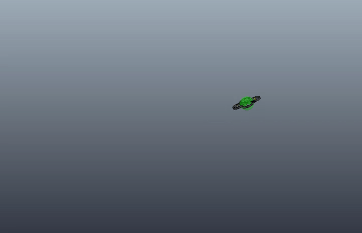

# Implementation of the paper proposed by G. Cano:
* Intelligent Control of a quadrotor with Proximal Policy Optimization Reinforcement Learning

## Requirements:
* V-REP
* hill-a/stable-baselines: PPO2

## Training in Episode 6000

